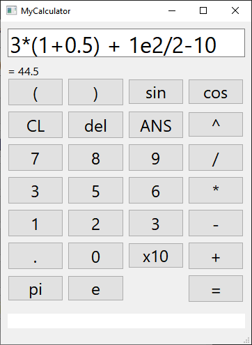
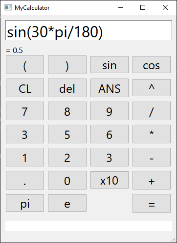
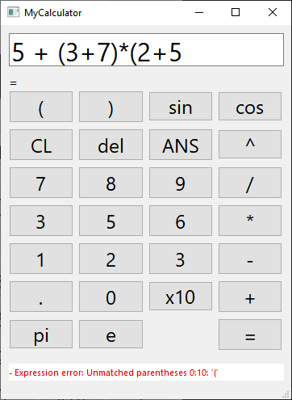
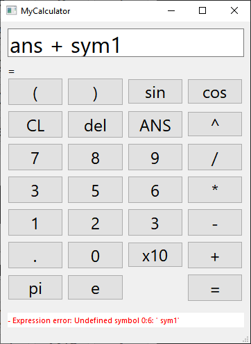

# My Calculator
An arithmetic expression parser that support spaces, parentheses, 
scientific notation, constants and functions written in c++.\
the project also implements common data structures like Dynamic Arrays, Linked List and Hash Map.\
It is stand-alone with no dependencies, except for Qt for MyCalculatorGUI.
It has full syntax and arithmetic error support.


## Screenshots:

### Simple Equations
 

### Error Handling
 


## Components:
* MathExpressionLib: The arithmetic expression parsing library.
* MyCalculatorConsole: A console calculator based on MathExpressionLib.
* MyCalculatorGUI: A GUI calculator based on MathExpressionLib.


## Build:
* Visual Studio: To build MathExpressionLib and MyCalculatorConsole.
* Qt: To build MyCalculatorGUI.


## Code Example:
```Cpp
Real solve_math_expression_str(const char* str)
{
	Tokenizer tokenizer = Tokenizer(str);
	Array<Token> tokens = tokenizer.tokenize();
	Array<std::string> errors = tokenizer.errors();

	if (errors.size() > 0)
	{
		printf("- Parsing error: %s\n", errors[0].c_str());
		return 0.0;
	}

	MathExpression math_exp = MathExpression(tokens);
	Real result = math_exp.solve();
	errors = math_exp.errors();
	if (errors.size() > 0)
	{
		printf("- Expression error: %s\n", errors[0].c_str());
		return 0.0;
	}

	return result;
}
```


## Tests
---
test number parser:
 - TEST EXPRESSION: [PASSED] Expression '500' = 500.000000 == 500.000000
 - TEST EXPRESSION: [PASSED] Expression '12345' = 12345.000000 == 12345.000000
 - TEST EXPRESSION: [PASSED] Expression '1e1' = 10.000000 == 10.000000
 - TEST EXPRESSION: [PASSED] Expression '5e-9' = 0.000000 == 0.000000
 - TEST EXPRESSION: [PASSED] Expression '123456789.0' = 123456789.000000 == 123456789.000000
 - TEST EXPRESSION: [PASSED] Expression '0.000005' = 0.000005 == 0.000005
 - TEST EXPRESSION: [PASSED] Expression '+9e-10' = 0.000000 == 0.000000
 - TEST EXPRESSION: [PASSED] Expression '1000e3' = 1000000.000000 == 1000000.000000
 - TEST EXPRESSION: [PASSED] Expression '-50e-1' = -5.000000 == -5.000000


test operators one at a time:
 - TEST EXPRESSION: [PASSED] Expression '5+6' = 11.000000 == 11.000000
 - TEST EXPRESSION: [PASSED] Expression '1-50' = -49.000000 == -49.000000
 - TEST EXPRESSION: [PASSED] Expression '9*8' = 72.000000 == 72.000000
 - TEST EXPRESSION: [PASSED] Expression '-5*4' = -20.000000 == -20.000000
 - TEST EXPRESSION: [PASSED] Expression '-5*-4' = 20.000000 == 20.000000
 - TEST EXPRESSION: [PASSED] Expression '6/2' = 3.000000 == 3.000000
 - TEST EXPRESSION: [PASSED] Expression '5/0.5' = 10.000000 == 10.000000
 - TEST EXPRESSION: [PASSED] Expression '0.9/0.1' = 9.000000 == 9.000000
 - TEST EXPRESSION: [PASSED] Expression '10^2' = 100.000000 == 100.000000
 - TEST EXPRESSION: [PASSED] Expression '2^2' = 4.000000 == 4.000000
 - TEST EXPRESSION: [PASSED] Expression '4^2' = 16.000000 == 16.000000
 - TEST EXPRESSION: [PASSED] Expression '2^3' = 8.000000 == 8.000000
 - TEST EXPRESSION: [PASSED] Expression '25^0.5' = 5.000000 == 5.000000
 - TEST EXPRESSION: [PASSED] Expression '16^0.25' = 2.000000 == 2.000000


test operator precedence:
 - TEST EXPRESSION: [PASSED] Expression '2+5*3' = 17.000000 == 17.000000
 - TEST EXPRESSION: [PASSED] Expression '2*5+3' = 13.000000 == 13.000000
 - TEST EXPRESSION: [PASSED] Expression '2+6*3/2' = 11.000000 == 11.000000
 - TEST EXPRESSION: [PASSED] Expression '90-50+3*2^2' = 52.000000 == 52.000000
 - TEST EXPRESSION: [PASSED] Expression '3+2*3+1' = 10.000000 == 10.000000
 - TEST EXPRESSION: [PASSED] Expression '2^5/4' = 8.000000 == 8.000000
 - TEST EXPRESSION: [PASSED] Expression '3^2/2-4' = 0.500000 == 0.500000


test parentheses:
 - TEST EXPRESSION: [PASSED] Expression '(2)' = 2.000000 == 2.000000
 - TEST EXPRESSION: [PASSED] Expression '(5)' = 5.000000 == 5.000000
 - TEST EXPRESSION: [PASSED] Expression '(123)' = 123.000000 == 123.000000
 - TEST EXPRESSION: [PASSED] Expression '0.5*(6+2)' = 4.000000 == 4.000000
 - TEST EXPRESSION: [PASSED] Expression '20/(1+4)' = 4.000000 == 4.000000
 - TEST EXPRESSION: [PASSED] Expression '2^(1+1+1)' = 8.000000 == 8.000000
 - TEST EXPRESSION: [PASSED] Expression '(1+1+1)^2' = 9.000000 == 9.000000


test multiple spaces:
 - TEST EXPRESSION: [PASSED] Expression '    50' = 50.000000 == 50.000000
 - TEST EXPRESSION: [PASSED] Expression '   (1   +10   )   ' = 11.000000 == 11.000000
 - TEST EXPRESSION: [PASSED] Expression '2  ^ 1' = 2.000000 == 2.000000
 - TEST EXPRESSION: [PASSED] Expression '2    ^ 3   ' = 8.000000 == 8.000000
 - TEST EXPRESSION: [PASSED] Expression '5   - 3 ' = 2.000000 == 2.000000


test multiple parentheses:
 - TEST EXPRESSION: [PASSED] Expression '((((123))))' = 123.000000 == 123.000000
 - TEST EXPRESSION: [PASSED] Expression '(10)*(5)-10' = 40.000000 == 40.000000
 - TEST EXPRESSION: [PASSED] Expression '(((10)*(5)-10))*((1+1))' = 80.000000 == 80.000000


 test errors:
 - SHOULD_ERROR: [PASSED] Expression '.' >>> unexpected character 0:0: '.'
 - SHOULD_ERROR: [PASSED] Expression '5..' >>> unexpected character 0:2: '.'
 - SHOULD_ERROR: [PASSED] Expression '61-e.' >>> unexpected character 0:4: '.'
 - SHOULD_ERROR: [PASSED] Expression '(1' >>> Unmatched parentheses 0:0: '('
 - SHOULD_ERROR: [PASSED] Expression '1+' >>> Missing operand for '+' operator 0:1
 - SHOULD_ERROR: [PASSED] Expression '1-' >>> Missing operand for '-' operator 0:1
 - SHOULD_ERROR: [PASSED] Expression '1*' >>> Missing operand for '*' operator 0:1
 - SHOULD_ERROR: [PASSED] Expression '1/' >>> Missing operand for '/' operator 0:1
 - SHOULD_ERROR: [PASSED] Expression '*' >>> Missing operand for '*' operator 0:0
 - SHOULD_ERROR: [PASSED] Expression '/1' >>> Missing operand for '/' operator 0:0
 - SHOULD_ERROR: [PASSED] Expression 'unknown_symbol1' >>> Undefined symbol 0:0: 'unknown_symbol1'
 - SHOULD_ERROR: [PASSED] Expression 'unknown_symbol2' >>> Undefined symbol 0:0: 'unknown_symbol2'
 - SHOULD_ERROR: [PASSED] Expression 'sdfsdfsd' >>> Undefined symbol 0:0: 'sdfsdfsd'
 - SHOULD_ERROR: [PASSED] Expression 'sdfsdfsd0(1)' >>> Undefined symbol 0:0: 'sdfsdfsd0'
---


## Done ✔️

