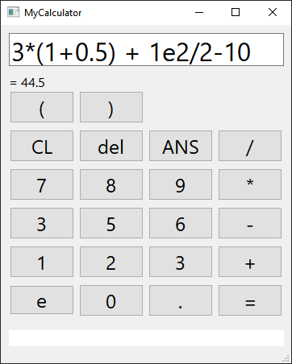

# My Calculator
An arithmetic expression parser that support spaces, parentheses, 
scientific notation, constants and functions written in c++.\
the project also implements common data structures like Dynamic Arrays, Linked List and Hash Map.\
It is stand-alone with no dependencies, except for Qt for MyCalculatorGUI.

## Screenshot:


## Components:
* MathExpressionLib: The arithmetic expression parsing library.
* MyCalculatorConsole: A console calculator based on MathExpressionLib.
* MyCalculatorGUI: A GUI calculator based on MathExpressionLib.

## Build:
* Visual Studio: To build MathExpressionLib and MyCalculatorConsole.
* Qt: To build MyCalculatorGUI.

## Code Example:
```Cpp
Real solve_math_expression_str(const char* str)
{
	Tokenizer tokenizer = Tokenizer(str);
	Array<Token> tokens = tokenizer.tokenize();
	Array<std::string> errors = tokenizer.errors();

	if (errors.size() > 0)
	{
		printf("- Parsing error: %s\n", errors[0].c_str());
		return 0.0;
	}

	MathExpression math_exp = MathExpression(tokens);
	Real result = math_exp.solve();
	errors = math_exp.errors();
	if (errors.size() > 0)
	{
		printf("- Expression error: %s\n", errors[0].c_str());
		return 0.0;
	}

	return result;
}
```

## References:
* Infix to postfix arithmetic algorithm: https://condor.depaul.edu/ichu/csc415/notes/notes9/Infix.htm
* tests source by Lukasz Wrobel: https://lukaszwrobel.pl/blog/math-parser-part-4-tests/

## Done ✔️

